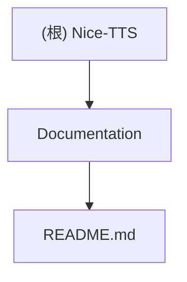

# Nice-TTS: AI-Powered Audio Transcription (Chinese Optimized)

## Project Vision

Nice-TTS is a powerful, batch-capable command-line tool that leverages AI to transcribe audio recordings with Chinese language optimization as the default configuration.

## Architecture Overview

This project is currently a minimal repository containing only documentation. The actual implementation appears to be missing or in a different location.

## Module Structure

## Module Index

| Module | Path | Language | Purpose | Status |
|--------|------|----------|---------|---------|
| Documentation | `/` | Markdown | Project documentation | ✅ Present |

## Development Status

**⚠️ Repository Structure Alert**: This repository contains only a README.md file. The actual Python implementation described in the documentation is not present in the current directory structure.

Expected structure based on README:
- Python source code (`src/` or `nice_tts/`)
- Configuration files (`pyproject.toml`, `requirements.txt`)
- Test directories (`tests/`)
- Environment configuration (`.env.example`)

## Running and Development

According to the README, the project should support:
- Python 3.11+ with `uv` package management
- GPU acceleration with CUDA support
- Command-line interface with `nice-tts` command
- Batch audio processing capabilities

However, these components are not present in the current repository state.

## Testing Strategy

No test infrastructure is currently present in the repository.

## Coding Standards

No specific coding standards or linting configuration found.

## AI Usage Guidelines

When working on this project:
1. Focus on implementing the described functionality based on the README
2. Maintain Python 3.11+ compatibility
3. Follow the described architecture for audio transcription
4. Ensure proper error handling for audio processing
5. Implement GPU acceleration support as described

## Change Log

### 2025-09-06 22:52:38 - Initial AI Context Initialization
- Repository inventory completed
- Identified missing implementation files
- Created initial project documentation
- Recommended next steps for project completion

## Next Steps

1. **Locate Implementation**: Verify if the Python implementation exists in a different branch or location
2. **Project Structure**: Create the missing project structure if starting from scratch
3. **Dependencies**: Set up `pyproject.toml` with required dependencies (OpenAI Whisper, torch, etc.)
4. **Source Code**: Implement the `nice_tts` Python package with described functionality
5. **Testing**: Add comprehensive test suite
6. **Configuration**: Create `.env.example` and configuration management

## Coverage Report

- **Total Files Found**: 1
- **Files Scanned**: 1 (README.md)
- **Coverage**: 100% of existing files
- **Missing Components**: Python implementation, configuration files, tests
- **Repository Status**: Documentation-only, implementation missing